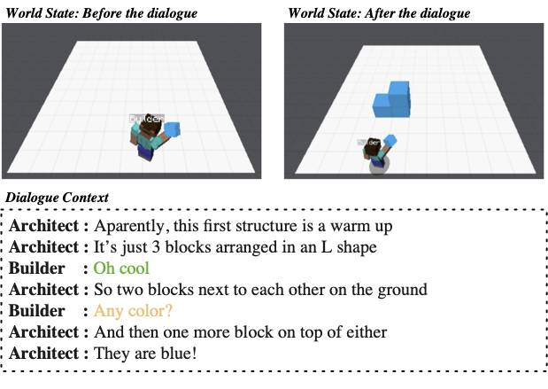

# Learning to Execute or Ask Clarification Questions
Here are the dataset and codes for the Findings of NAACL paper titled "[**Learning to Execute or Ask Clarification Questions**](https://arxiv.org/abs/2204.08373)". 

## Introduction
An intelligent agent should not only understand and execute the instructor's requests but also be able to take initiatives, e.g., asking clarification questions, in case the instructions are ambiguous.

<p align="center">
    
</p>
<p align="center">
    <b>A simple example of builder task. </b>
</p>

## Code and Dataset
- `CollaborativeBuilding`: Codes for collaborative building task;
- `LearnToAsk`: Codes for learning to ask task and joint learning task;
- `builder_utterance_labels.json`: Annotations of all builder utterances.
- The raw dataset `Minecraft Dialogue Corpus` is from the [repository](https://github.com/prashant-jayan21/minecraft-bap-models#raw-data).


## Citation
Please cite our work if it is helpful.
```
@inproceedings{Shi2022learning,
title = {Learning to execute or ask clarification questions},
author = {Shi, Zhengxiang and Feng, Yue and Lipani, Aldo},
year = {2022},
address = {Seattle, Washington, USA},
booktitle = {Findings of the North American Chapter of the Association for Computational Linguistics},
publisher = {Association for Computational Linguistics},
keywords = {Conversational System, Clarification Questions},
url = {https://arxiv.org/abs/2204.08373}
}
